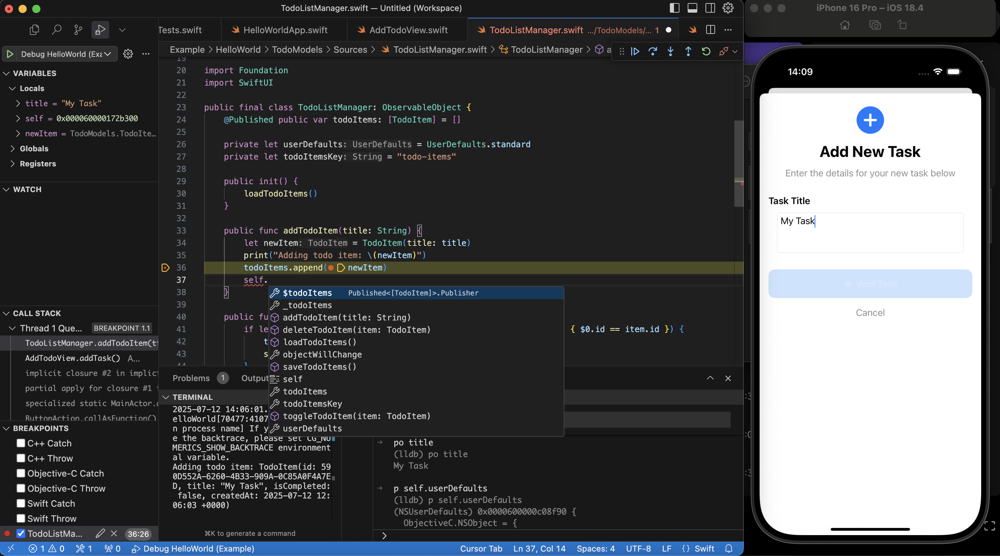

# iOS Development (and more) in alternative IDEs like Cursor / VSCode, for Bazel projects

**sourcekit-bazel-bsp** is a [Build Server Protocol](https://build-server-protocol.github.io/) implementation that serves as a bridge between [sourcekit-lsp](https://github.com/swiftlang/sourcekit-lsp) (Swift's official [Language Server Protocol](https://microsoft.github.io/language-server-protocol/)) and your Bazel-based code, giving you the power to break free from the IDE side of Xcode and **develop for Apple platforms like iOS in any IDE that has support for LSPs**, such as Cursor and VSCode.

> [!IMPORTANT]
> sourcekit-bazel-bsp is designed specifically for projects that use the [Bazel build system](https://bazel.build/) under the hood. It will not work for regular Xcode projects. For Xcode, check out projects like [xcode-build-server](https://github.com/SolaWing/xcode-build-server) (unrelated to this project and Spotify).

> [!WARNING]
> sourcekit-bazel-bsp is currently in very early stages of development and is not ready for production usage. It currently works only at a limited capacity and is missing several important features.



## Features

- [x] All of the usual indexing features such as code completion, jump to definition, error annotations and so on, for both Swift and Obj-C (via the official [sourcekit-lsp](https://github.com/swiftlang/sourcekit-lsp))
- [x] (Cursor / VSCode): Building and launching, all from within the IDE and directly via Bazel (no project generation required!)
- [x] (Cursor / VSCode): Full `lldb` integration, allowing debugging from within the IDE just like Xcode (via [lldb-dap](https://marketplace.visualstudio.com/items?itemName=llvm-vs-code-extensions.lldb-dap), automatically provided by the official Swift extension)
- [ ] (Cursor / VSCode): Simulator selection from within the IDE
- [ ] (Cursor / VSCode): Automatic generation of build, launch, and debug tasks
- [ ] (Cursor / VSCode): Test explorer & ability to run tests from within the IDE by clicking the tests individually, similarly to Xcode
- [ ] Automatic index and build graph updates when adding / deleting files and targets (in other words, allowing the user to make heavy changes to the project without needing to restart the IDE)

## Requirements

- Swift 6.1+ toolchain (equivalent to Xcode 16.4+)
  - Note that even though sourcekit-bazel-bsp itself is completely detached from Xcode, **you will still need to have Xcode installed on your machine to do any sort of actual Apple development.** This is because installing Xcode is currently the only way to get access to and manage the platform toolchains, so even though this tool allows you to break free from the Xcode IDE itself, you still need to have it around for toolchain reasons. In order to completely avoid Xcode, we would need Apple to detach it from the toolchains and all their related tooling.

## Initial Setup Instructions

### Cursor / VSCode

- Make sure your Bazel project is using compatible versions of all iOS-related Bazel rulesets and is configured to generate Swift/Obj-C indexing data and debug symbols, either by default or under a specific config.
  - Detailed information on this is currently WIP, but you can currently check out the [example project](./Example) for an example.
- Make sure all transitive libraries you'd like to use the BSP for have accompanying `(platform)_build_test` rules that directly targets them and have the `(lib_name)_{ios,watchos,tvos,macos,visionos}_skbsp` naming scheme.
  - This is because Bazel is currently missing a couple of important features we need in order to make this work in a clean way. This requirement can thus be seen as temporary, and you can expect it to be removed in the future as we evolve the tool and those missing features are introduced.
  - Keep in mind that our current focus are iOS targets, so as of writing your mileage may vary regarding other platforms.
- Download and install [the official Swift extension](https://marketplace.visualstudio.com/items?itemName=swiftlang.swift-vscode) for Cursor / VSCode.
- On Cursor / VSCode, open a workspace containing the repository in question.
- Integrate BSP Server:
  - Automated (suggested)
    - Add the following to your `MODULE.bazel` file:

    ```python
    bazel_dep(name = "sourcekit_bazel_bsp", version = "0.0.5", repo_name = "sourcekit_bazel_bsp")
    ```

    - Define a `setup_sourcekit_bsp` in a BUILD.bazel file in the root of your workspace:

      ```python
      load("@sourcekit_bazel_bsp//rules:setup_sourcekit_bsp.bzl")

      setup_sourcekit_bsp(
        name = "setup_sourcekit_bsp",
        targets = YOUR_TARGETS,
        bazel_wrapper = "/usr/local/bin/bazelisk" # Defaults to bazel
        index_flags = [], # Optional indexing flags to pass to the build
        files_to_watch = ["src/MyApp/**/*.swift"] # Globs of files to watch for changes to
      )
      ```

    - Run `bazel run //:setup_sourcekit_bsp`
    - Thats it you have now integrated the tool. Users should re-run that command whenever the configuration is changed.

  - Manual
    - Copy the .bsp/ folder on this repository to the root of the repository you'd like to use this tool for.
    - Edit the `argv` fields in `.bsp/config.json` to match the details for your app / setup. You can see all available options by running `sourcekit-bazel-bsp serve --help`.
- On the settings page for the Swift extension, enable `SourceKit-LSP: Background Indexing` at the **workspace level**. It **has** to be workspace settings; this specific setting is not supported at the folder level.
- Reload your workspace (`Cmd+Shift+P -> Reload Window`)

After following these steps, the `SourceKit Language Server` output tab (_Cmd+Shift+U_) should show up when opening Swift or Obj-C files, and indexing-related actions will start popping up at the bottom of the IDE after a while alongside a new `SourceKit-LSP: Indexing` output tab when working with those files.

If you experience any trouble trying to get it to work, check out the [Example/ folder](./Example) for a test project with a pre-configured Bazel and `.bsp` setup. The _Troubleshooting_ section below also contains instructions on how to debug sourcekit-bazel-bsp.

### Other IDEs

The setup instructions depend on how the IDE integrates with LSPs. You should then search for instructions on how to install sourcekit-lsp on your IDE of choice and enable background indexing. After that, follow the `.bsp/` related steps from the above instructions. Keep in mind that this since project is developed specifically with Cursor / VSCode in mind, we cannot say how well sourcekit-bazel-bsp would work with other IDEs.

## Troubleshooting

### Seeing sourcekit-bazel-bsp's logs

sourcekit-bazel-bsp uses Apple's OSLog infrastructure under the hood. To see the tool's logs, run `log stream --process sourcekit-bazel-bsp --debug` on a terminal session.

By default, most logs will be redacted for privacy reasons, but you may want to see them for debug and development reasons. To enable extended logging and expose those logs, install the configuration profile at [as described here](https://support.apple.com/guide/mac-help/configuration-profiles-standardize-settings-mh35561/mac#mchlp41bd550) You will then able to see the redacted logs.

If you wish for the logs to become redacted again, you can remove the configuration profile [as described here.](https://support.apple.com/guide/mac-help/configuration-profiles-standardize-settings-mh35561/mac#mchlpa04df41.)

### Debugging

Since sourcekit-bazel-bsp is initialized from within sourcekit-lsp, debugging it requires you to start a lldb session in advance. You can do it with the following command: `lldb --attach-name sourcekit-bazel-bsp --wait-for`

Once the lldb session is initialized, triggering the initialization of the Swift extension on your IDE of choice (e.g. opening a Swift file in VSCode) should eventually cause lldb to start a debugging session.
