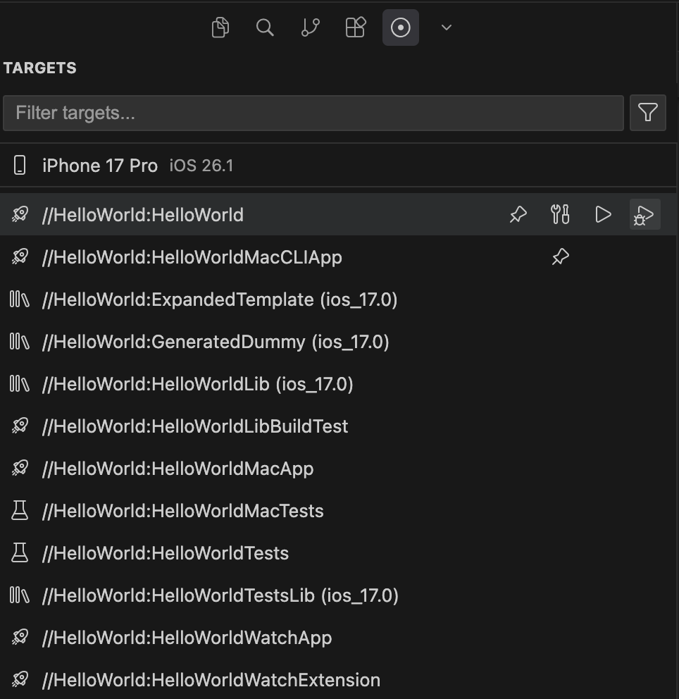
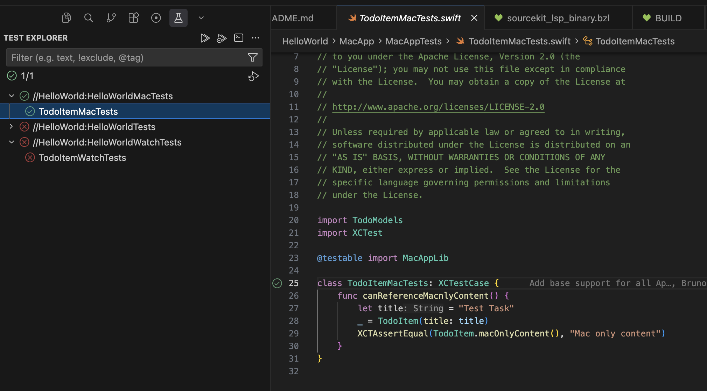

# Cursor/VSCode SourceKit Bazel BSP Companion Extension

This is a companion extension for Cursor / VSCode that uses the data exported by the BSP to provide a much deeper IDE integration than what's it's possible with the BSP alone, such as build / test / launch buttons, simulator management and selection, automatic test discovery, as well as integrating with the IDE's native task systems.

**The extension is considered WIP and must be compiled from source for the moment. We are actively adding and changing features.**

## Features

- Build, test, launch, and debug apps, libraries and tests
    - [X] iOS
    - [-] macOS (Missing debug functionality)
    - [-] watchOS (Missing test, launch, and debug functionality)
    - [-] tvOS (Missing test, launch, and debug functionality)
    - [-] visionOS (Missing test, launch, and debug functionality)
- [X] Ability to run tests via the source file itself
- Manage and select devices
    - [X] Simulators
    - [ ] Physical devices
- [X] Output tab for visualizing logs from the BSP
- [ ] Build mode selection (Debug/Release)

## Setup/Development Instructions

### Installing for debug usage

- Setup your node environment manager to use the version noted down in `.nvmrc`.
- Run `npm install` to install all dependencies.
- To compile the extension, run: `npm run compile`.
- To **debug** the extension, open this folder in a workspace and press F5 to run the default debug task. This will launch a new special debug workspace that has the extension automatically installed.

### Installing for production usage

- Setup your node environment manager to use the version noted down in `.nvmrc`.
- Run `npm install` to install all dependencies.
- Run `npx vsce package` to generate a .vsix.
- Install it with `cursor --install-extension (vsix_path)` or `code --install-extension (vsix_path)`, depending on your IDE.

## Using the extension

The extension automatically bootstraps itself up based on the information provided by the BSP. After the BSP finishes calculating the project's dependency graph, the `SourceKit Bazel BSP` tab of the IDE should start displaying all of the relevant information and actions.

Aside from the dedicated tab, the extension will also populate the IDE's native task system will all relevant build/test/launch jobs, as well as filling the IDE's native Testing tab when interacting with test files.

## Available settings

| Setting | Type | Default | Description |
|---------|------|---------|-------------|
| `sourcekit-bazel-bsp.extraBuildFlags` | string | `""` | Extra build flags to pass to Bazel when building targets (e.g., `--config=apple_cursor_build`). Separate flags with a space. |
| `sourcekit-bazel-bsp.extraTestBuildFlags` | string | `""` | Extra build flags to pass to Bazel when building tests (added on top of extraBuildFlags). Separate flags with a space. |
| `sourcekit-bazel-bsp.launchArgs` | string | `""` | **Launch** arguments to pass to apps when launching (e.g. `'-AppleLanguages (fr)'`). Separate flags with a space. |
| `sourcekit-bazel-bsp.testArgs` | string | `""` | **Launch** arguments to pass when running tests (added on top of launchArgs). Separate flags with a space. |
| `sourcekit-bazel-bsp.processedGraphPath` | string | `".bsp/skbsp_generated/graph-processed.json"` | Path to the processed graph JSON file (relative to workspace root). This exists to enable cases where you might want to do special work on top of what the extension provides by default. |
| `sourcekit-bazel-bsp.appsToAlwaysInclude` | array | `[]` | Bazel labels that should always be treated as top-level apps (only added if not already in the graph) |
| `sourcekit-bazel-bsp.enableTestDiscovery` | boolean | `true` | Enable automatic test discovery for gutter icons. When enabled, test gutter icons appear next to test classes and methods in Swift and Objective-C files. |
| `sourcekit-bazel-bsp.rulesAppleName` | string | `"rules_apple"` | The name of the rules_apple external repository (e.g., rules_apple) |
